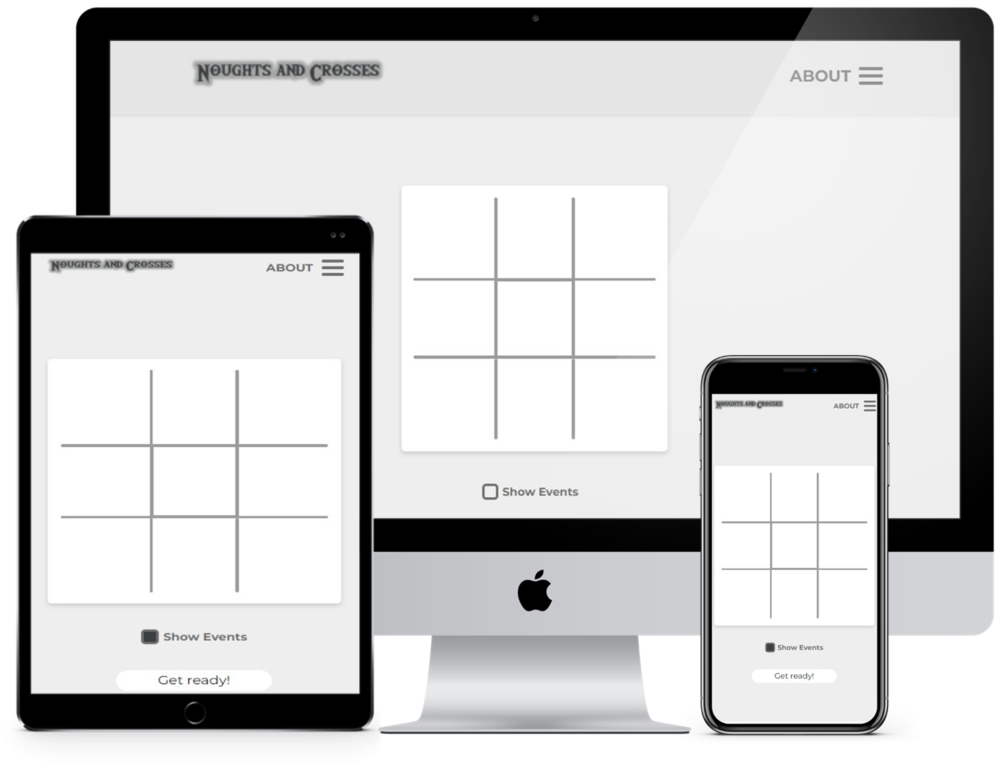
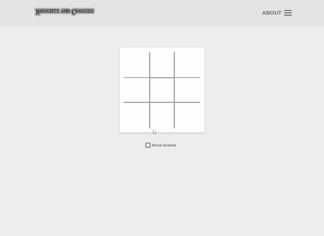
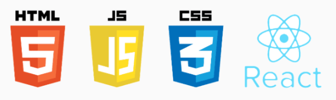

<h1 align="center">
    
</h1>

<p align="center">
  <a href="#-Project">Project</a>&nbsp;&nbsp;&nbsp;|&nbsp;&nbsp;&nbsp;
  <a href="#-Layout">Layoult</a>&nbsp;&nbsp;&nbsp;|&nbsp;&nbsp;&nbsp;
  <a href="#-Technology">Technology</a>&nbsp;&nbsp;&nbsp;|&nbsp;&nbsp;&nbsp;
  <a href="#-Environment">Environment</a>&nbsp;&nbsp;&nbsp;|&nbsp;&nbsp;&nbsp;
  <a href="#%EF%B8%8F-license">License</a>&nbsp;&nbsp;&nbsp;|&nbsp;&nbsp;&nbsp;
  <a href="#-Participants">Participants</a>
</p>
<br>

<p align="center">
  
</p>
<br>

<p align="center">
 
</p>

## 💻 Project

<strong>Nought and Crosses</strong> game made with <strong>React</strong>. 🎲

The intention of doing this project is to consolidate the knowledge in <strong>React</strong>. 🎓

<br>

## 🎨 Layout
<p align="center">


<br>

## 🔨 Technology

<p align="center">
  
</p>

<br>

## 📝 Environment

1. Clone the repository: 
```bash 
git@github.com:CaioLemec/nought-and-crosses.git
```
2. Install node: 
```bash
 https://nodejs.org/en/
 ```
3. Open project folder in VSCode:
```bash
 cd ../nought-and-crosses
 ```
4. Install dependencies by using command:
```bash
 npm install
 ```
5. At your terminal set this command line:
```bash
npm start
```
7. Access the generated address in your browser:
```bash
http://localhost:3000/
```

<br>

## ⚖️ License

<br>

This project is licensed under the Apache 2.0 [LICENSE](LICENSE.md).

<br>

## 😃 Participants
<br>

<br>
<sub>&nbsp;&nbsp;&nbsp;Caio Lemec</sub>

<br>
<br>

[](caiolemec@gmail.com) [](https://br.linkedin.com/in/caio-lemec/) 


<hr>

<p align="center">⭐&nbsp;&nbsp;&nbsp;   Developed by Caio Lemec  &nbsp;&nbsp;&nbsp;⭐</p>
